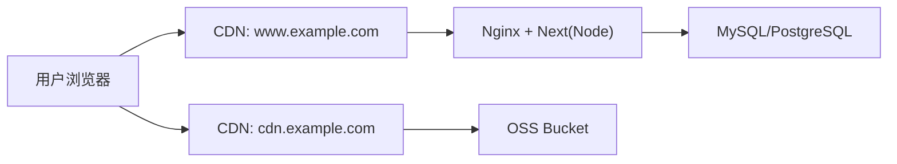

# 部署拓扑与缓存规则样例（阿里云 OSS + CDN + Nginx）

## 1) 拓扑



- `www.example.com`：页面与 API。
- `cdn.example.com`：静态资源（模板图、`/_next/static/*`、图标等）。

## 2) 环境变量

```bash
SITE_ORIGIN=https://www.example.com
NEXT_PUBLIC_SITE_ORIGIN=https://www.example.com
NEXT_PUBLIC_CDN_ORIGIN=https://cdn.example.com
NEXT_PUBLIC_ASSET_PREFIX=https://cdn.example.com
```

## 3) CDN 缓存策略

### `cdn.example.com`（回源 OSS）

- 路径：`/_next/static/*`, `/templates/*`, `/icons/*`
- 缓存头：`Cache-Control: public, max-age=31536000, immutable`
- 开启 Brotli/Gzip

### `www.example.com`（回源 Nginx）

- `/_next/static/*`：长缓存（1 年）
- `/api/*`：`private, no-store`
- `/resume/*`、`/dashboard*`、`/onboarding*`：`private, no-store`
- `/`、`/pricing`、`/faq`、`/install`：`s-maxage=300, stale-while-revalidate=60`

## 4) Nginx 规则样例

```nginx
server {
  listen 443 ssl http2;
  server_name www.example.com;

  location ~* ^/_next/static/ {
    proxy_pass http://127.0.0.1:3000;
    add_header Cache-Control "public, max-age=31536000, immutable" always;
  }

  location ^~ /api/ {
    proxy_pass http://127.0.0.1:3000;
    add_header Cache-Control "private, no-store" always;
  }

  location ~* ^/(resume|dashboard|onboarding) {
    proxy_pass http://127.0.0.1:3000;
    add_header Cache-Control "private, no-store" always;
  }

  location / {
    proxy_pass http://127.0.0.1:3000;
    add_header Cache-Control "public, s-maxage=300, stale-while-revalidate=60" always;
  }
}
```

## 5) 导出策略说明

- PDF 与图片导出在前端执行，不依赖后端生成任务。
- 如需分享下载链接，可在后续增加“前端导出后上传 OSS”流程。
